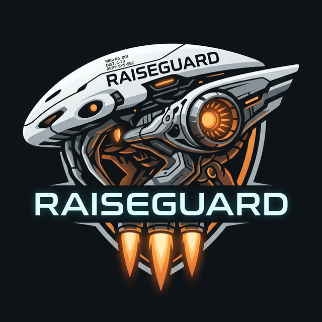

  
  <h1>MCP Course Workshops</h1>
  
<b>Advanced Agentic AI & Cybersecurity Interactive Workshops</b>

---

Welcome to the official interactive Jupyter Notebooks and practical exercises for the Advanced Agentic AI Course. 

These workshops are designed to be run entirely in your web browser using **Google Colab**. You do not need to install Python or any heavy AI libraries on your local machine.

## 🚀 How to Run the Workshops

1. Choose a workshop below and open its `.ipynb` file.
2. Click the **"Open in Colab"** badge at the top of the notebook.
3. Once in Colab, click **File > Save a copy in Drive** to save your progress.
4. Add your Groq API key when prompted in the first code cell.
5. Execute the cells and start building agents!

---

## 📂 The Workshops

<table width="100%">
  <tr>
    <td width="20%" align="center"></td>
    <td width="80%">
      <h3><a href="Workshop_01_CTI_Automation/">🛡️ 1. CTI Automation</a></h3>
      Build an automated Cyber Threat Intelligence pipeline. Convert raw intelligence into structured, actionable data using autonomous AI agents.
    </td>
  </tr>
  <tr>
    <td width="20%" align="center"></td>
    <td width="80%">
      <h3><a href="Workshop_02_Threat_Hunting/">🕵️ 2. Threat Hunting</a></h3>
      Use Agentic AI to proactively hunt for network anomalies, ingest massive event logs, and identify deeply hidden adversarial behavior.
    </td>
  </tr>
  <tr>
    <td width="20%" align="center"></td>
    <td width="80%">
      <h3><a href="Workshop_03_Network_Analysis/">📡 3. Network Analysis</a></h3>
      Leverage agents to analyze PCAP files and network flows. Automatically map attacker infrastructure and decode malicious payloads.
    </td>
  </tr>
  <tr>
    <td width="20%" align="center"></td>
    <td width="80%">
      <h3><a href="Workshop_04_Malware_Analysis/">🦠 4. Malware Analysis</a></h3>
      Use autonomous agents to safely perform malware behavior analysis, construct YARA rules dynamically, and identify sophisticated obfuscation.
    </td>
  </tr>
  <tr>
    <td width="20%" align="center"></td>
    <td width="80%">
      <h3><a href="Workshop_05_FastMCP_Deploy/">🚀 5. FastMCP Deployment</a></h3>
      Build and deploy Model Context Protocol (MCP) servers rapidly. Expose powerful cybersecurity tools as standard capabilities to large language models.
    </td>
  </tr>
</table>

---

  
Built for the <b>RAISEGUARD</b> Academy

